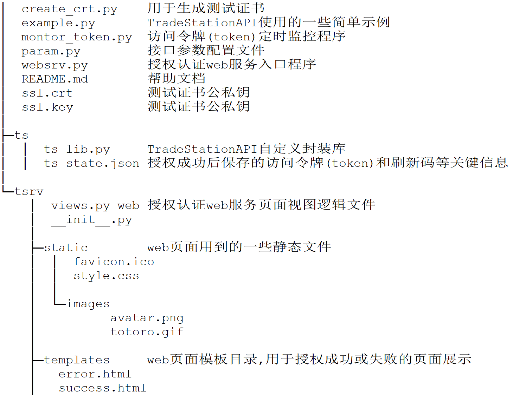
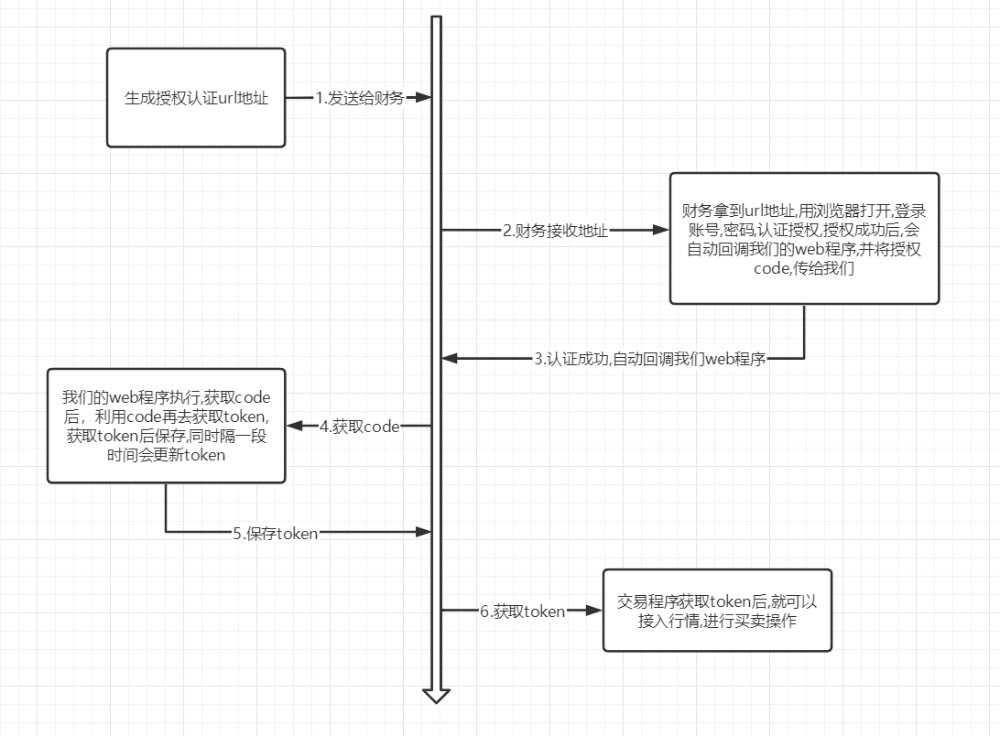

## pyts

本项目封装了Tradestation API,提供Tradestation便捷交易服务,项目整体如下图:

在Tradestation API 进行交易之前,先要进行授权认证,其采用了OAuth2.0的授权码认证方式,我们这里自定义封装成web登录授权认证模式,如下图：

在测试中,我们可以利用create_crt.py生成测试证书,可以运行websrv.py启动web授权认证服务,然后登录http://127.0.0.1/login 进行登录授权, 当授权成功后访问令牌等关键信息会被保存到ts_state.json中,因为访问令牌默认1200秒就会超时,所以我们还可以运行montor_token.py对访问令牌(token)进行定时自动检测并刷新访问令牌.

当我们拥有了合法的访问令牌后,就可以进行各种操作了. example.py中提供了一些简单示例,比如符号相关,账号信息,报价等,更详细的细节可以访问官方文档 https://tradestation.github.io/api-docs/
